# dsh-damage-pulse

<p align="center">
  
</p>

<p align="center">
  <a href="https://linux.do/t/topic/2773449" target="_blank" rel="noopener noreferrer"></a>
  <a href="#sponsor"></a>
</p>

`dsh-damage-pulse` 是为 DSH（DeepSeek Harness）打造的 DeepSeek 用量、消费与余额监控插件。它按照官方计费规则记录每次调用，通过单次、会话和全局三个层级呈现 Token 与费用，并用鲸鱼娘的动态反馈把抽象的模型消耗变成一眼就能看懂的变化。

<a id="model-sponsor"></a>
<h2> <a href="https://www.fastaitoken.com/register?aff=BF9KNKFHX725&promo=WSSFK">Fastai</a> 模型赞助商<br><sub><sup>免费不意味着开发没有成本。感谢<a href="https://www.fastaitoken.com/register?aff=BF9KNKFHX725&promo=WSSFK">Fastai</a>的赞助，让我能把功能留给所有用户，把广告留在应用之外。</sup></sub></h2>

如果你正在寻找稳定、实惠的 AI 模型中转服务，可以试试 [Fastai](https://www.fastaitoken.com/register?aff=BF9KNKFHX725&promo=WSSFK)，[Fastai](https://www.fastaitoken.com/register?aff=BF9KNKFHX725&promo=WSSFK) 提供 DeepSeek、GLM、kimi、GPT、Claude、grok 等模型厂商的旗舰模型，同时还提供 image2.5、**Seedance 2.0** 等最先进的图片和视频生成模型。国模分组采用大厂自部署模型，低延迟高缓存，注册即送 3$ 体验金，欢迎试用。目前 GPT 分组不能完全保证不降智，推荐使用其它分组。本项目全程使用 [Fastai](https://www.fastaitoken.com/register?aff=BF9KNKFHX725&promo=WSSFK) 提供的 GPT、DeepSeek 等模型开发，你的每一笔充值都会使我获得返利和更多 token 来继续维护和开发新功能。 <a href="https://www.fastaitoken.com/register?aff=BF9KNKFHX725&amp;promo=WSSFK"></a>

## 功能总览

| 能力 | 你能看到什么 |
|---|---|
| 精准计费 | 按 provider、model、缓存类型和北京时间峰谷价格计算每次真实费用 |
| 三层用量展示 | 对话内单次明细、输入区会话累计、全局账户余额悬浮卡 |
| 历史统计 | 今日、近 7 天、近 30 天和全部历史的消费、请求与 Token 概览 |
| 余额与峰谷监控 | 官方余额定时校准、实时扣减、充值恢复及峰谷状态提示 |
| 鲸鱼娘动态反馈 | 待机、眨眼、扣费受击、缓存未命中、余额耗尽与充值复活 |
| 主动提醒 | 每日预算、峰谷切换、缓存命中异常和鲸鱼娘通知气泡 |
| 微信通知 | 在详细设置中登录、管理 ClawBot，并接收少女风业务提醒 |
| 模块化管理 | 查看五个功能模块的安装状态、按需卸载或整体卸载，并在插件内检查与安装更新 |
| 可编辑计费规则 | 按 provider/model 编辑固定价或峰谷价、阶梯与倍率，并可编写第三方供应商余额查询脚本 |
| 详细用量窗口 | 可拖动缩放的明细窗口：时间/供应商/模型/项目/对话筛选、列设置、费用构成与分页 |
| 节假日峰谷 | 法定节假日与调休上班的周末整日按空闲时段（谷价）计算 |
| 安全更新 | 检查 GitHub Release，验证版本、来源与 SHA-256 后再安装 |

### 2026 年 9 月官方计价更新

- 北京时间 9 月 10 日 12:00 起，`deepseek-flash`（V4.1 Flash）、`deepseek-v4-flash` 和 `deepseek-v4-flash-vision-exp` 共用 Flash 新价。每百万 tokens：空闲时段缓存命中输入 ¥0.02、未命中输入 ¥1、输出 ¥4；高峰时段分别为 ¥0.04、¥2、¥8。
- 高峰为北京时间工作日 09:00–12:00、14:00–18:00，周末全天空闲。
- 官方已取消原定北京时间 9 月 14 日 12:00 起 `deepseek-v4-pro` 按 Flash 价格计费的调整：V4 Pro 继续按原 Pro 价格计费；空闲时段缓存命中输入 ¥0.15、未命中输入 ¥4.5、输出 ¥13.5，高峰时段分别为 ¥0.3、¥9、¥27。如有变动按官网通知另行更新。
- 会话金额缓存升级后会按可用事件重算；不会重写已持久化的 usage 账本。官方内置价格表按生效时间分段计价：北京时间 8 月 17 日 00:00 之前按旧统一价，8 月 17 日 00:00 至 9 月 10 日 12:00 按旧峰谷价，之后按现行价格。显式自定义价格表整体优先于默认表、不做历史分段；更新价格规则后需重启插件宿主加载。
- 北京时间 9 月 25 日起，法定节假日整日按空闲时段（谷价）计价：节假日当天不再有 09:00–12:00、14:00–18:00 的高峰价。周末同样整日按空闲时段计价，且**不区分是否调休上班**——因节假日调休而需要上班的周六、周日也全天按谷价，不进入工作日高峰时段。该口径对 DeepSeek 模型统一生效：官方内置价格表与第三方自定义规则使用同一套峰谷判定。
- 价格依据：[DeepSeek 官方模型与价格](https://api-docs.deepseek.com/zh-cn/quick_start/pricing)。

### 精准计费与持久账本

- 同时依据 provider 与 model 判断计费资格，未知或不合格模型不会套用默认价格。
- 分别统计未缓存输入、缓存读取、缓存写入和输出，并按调用发生时的北京时间选择峰价或谷价。
- 视觉模型直接使用 DeepSeek 返回的 usage 数据，不对图片 Token 重复估算。
- 合格调用写入本地持久账本；重启后可恢复历史统计和会话摘要，零成本记录不会污染账本。
- 使用 `sessionId + sourceEventSeq` 保证事件幂等，避免重放导致重复扣费。

### 三层用量与历史统计

- **单次用量行**：每次模型调用结束，在对话流中显示输入、缓存、输出、思考 Token 和精确金额。
- **会话累计条**：输入区持续显示当前会话累计 Token 与费用。
- **全局悬浮卡**：跨会话持续显示 DeepSeek 账户余额；今日消费与历史范围统计集中在详细设置概览中。
- **统计概览**：支持今日、近 7 天、近 30 天和全部时间，汇总消费金额、请求数、Token 总数、缓存命中 Token、缓存命中率和活跃天数。
- **中文大数单位**：概览按“万、千万、亿、万亿”逐级显示，千万级数字不再折算成两位数的“百万”；舍入跨越边界时会自动提升单位。

### 余额、峰谷与悬浮交互

- 查询 DeepSeek 官方余额并每 60 秒校准；扣费事件到达时先逐笔更新显示余额，充值后以绿色反馈恢复金额。
- 余额查询失败或缺少 API Key 时显示明确状态；本地账本统计的今日消费不依赖余额接口成功。
- 峰谷标识每 30 秒刷新，峰时使用红色、谷时使用绿色提示。
- 悬浮卡支持鼠标拖动、键盘移动、视口边界限制和位置记忆；右键可隐藏鲸鱼娘或打开详细设置。
- 右键菜单提供「显示鲸鱼娘」「显示用量概览」「用量明细」「通知设置」「计费规则」和「卸载与更新」六个入口。

<p align="center">
  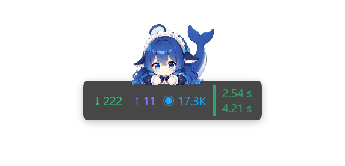
  &nbsp;&nbsp;
  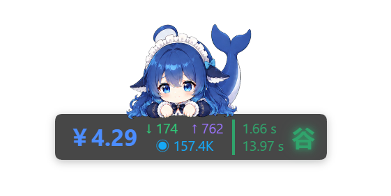
</p>

<p align="center">
  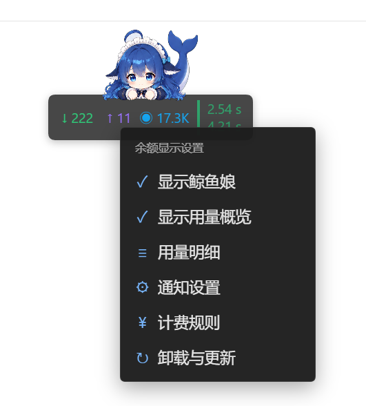
</p>


## 模块化管理

插件把能力拆成五个可以单独卸载的功能模块：**桌宠功能区**（鲸鱼娘动画、拖动与桌宠资源）、**数据概览功能区**（数据概览、用量明细与历史查询）、**通知功能区**（预算、异常、峰谷提醒与桌宠气泡）、**计费规则功能区**（官方/第三方计费规则、余额查询与扣费动画）、**微信通知渠道**（微信登录、连接、测试消息与投递）。

- 在「卸载与更新」面板可以看到当前插件版本、每个模块的安装状态，单独卸载某个模块，或者一次性卸载整个插件。
- 已卸载的模块会记住状态并禁止自动重装；卸载只移除该模块的代码载荷，不会删除用量账本、设置与历史数据。
- 「检查更新」读取项目主页的 GitHub Release，比较版本后提供「安装更新」；安装前会校验版本、资产名称、下载来源与 SHA-256，只有识别到可安装的 profile 时才执行安装。
- 用量采集属于常驻基础能力：卸载整个插件时会一并停止采集，重新安装后恢复。

<p align="center">
  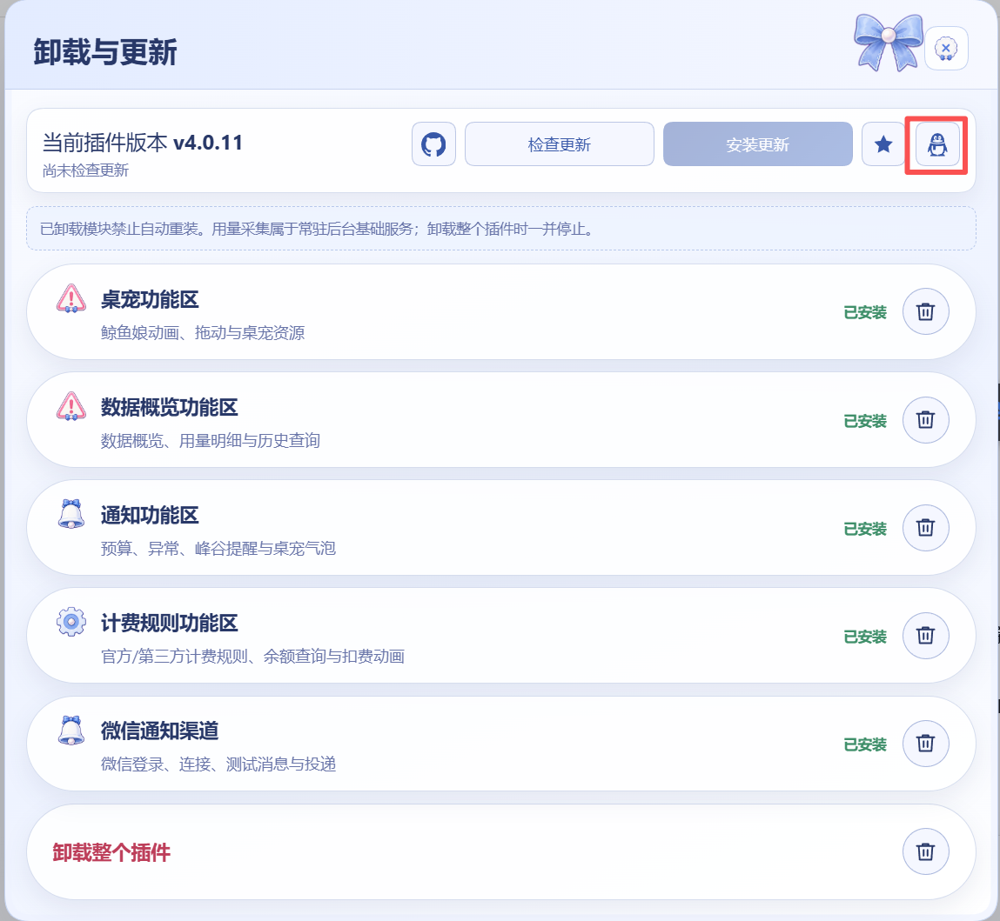
</p>

## 可视化计费规则

计费规则面板把「每条 provider/model 怎么算钱」做成可编辑的表单：官方内置价格表之外，第三方中转商也能按自己的价目表计费。

- **固定价或峰谷价**：每个模型可以选择「固定」或「峰谷」；峰谷模式下自行增删高峰时段，按「时:分」选择开始与结束时间并勾选周几，其余时间为谷价。
- **法定节假日与调休周末**：2026 年 9 月 25 日起，法定节假日整日按空闲时段（谷价）计价；因节假日调休而上班的周六、周日同样整日按空闲时段（谷价）计价，不会因为当天上班而进入高峰时段。只要模型属于 DeepSeek，官方价格表与第三方自定义规则使用同一套峰谷判定。
- **阶梯与倍率**：按最大上下文 Token 配置阶梯单价，倍率用于中转商的加价系数。
- **模板与来源**：可选择官方模板预览对比后一键应用；面板显示规则来源、版本与「已自动保存」状态，模型与供应商都可以单独启停。
- **供应商余额查询脚本**：为第三方供应商写一小段 JavaScript 描述余额接口（请求路径、方法、鉴权方式，以及如何处理返回的 JSON），在沙箱里校验通过后，悬浮卡即可显示该供应商的余额。

<p align="center">
  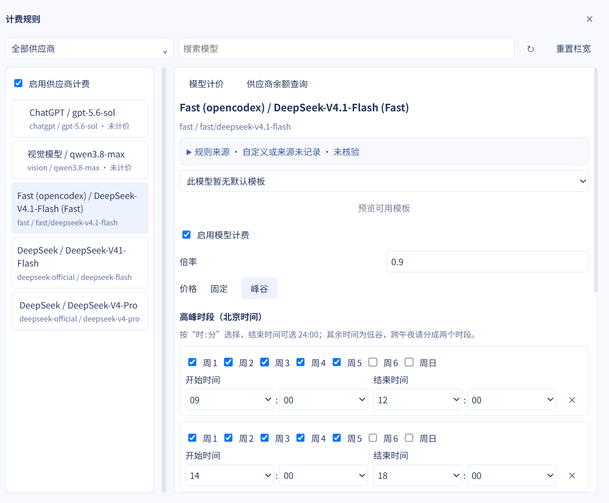
</p>

<p align="center">
  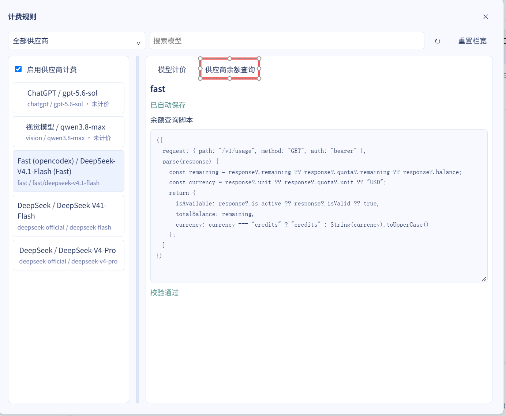
</p>

计费规则窗口和用量明细窗口一样支持拖动、八向缩放、最大化与位置记忆；点窗口外的空白处不会关闭，方便一边看对话一边改价格。

## 详细用量窗口

悬浮卡右键菜单里的「用量明细」会打开一个可以拖动、缩放、最大化的独立窗口。窗口位置与尺寸会被记住，也不会挡住后面的对话操作。

- **数据概览**：消费、请求数、Token 总数、活跃天数、缓存命中 Token、缓存命中率、每亿 Token 费用、活跃日均消费八项指标，可切换时间范围并按供应商筛选。
- **明细表**：模型、对话、Provider、项目、Token（未缓存输入 / 输出 / 缓存命中）、推理 Token、推理强度、本地费用、延迟（首字与总耗时）与记录时间，峰谷标记直接写在时间列。
- **筛选与分页**：开始/结束时间、模型、项目、对话，以及「错误请求」页的错误类型与是否包含已取消请求；每页 20/50/100 条。
- **列设置**：自己勾选要显示的列，或者一键恢复默认列。下拉卡片贴着按钮显示、不会遮住入口，点窗口里任意空白处即可收起。
- **费用构成**：点费用旁的 ⓘ 展开未缓存输入、缓存命中、缓存写入、输出四项费用与 Token 数、对应单价、实际计价模式、命中阶梯上限、倍率与规则标识。

<p align="center">
  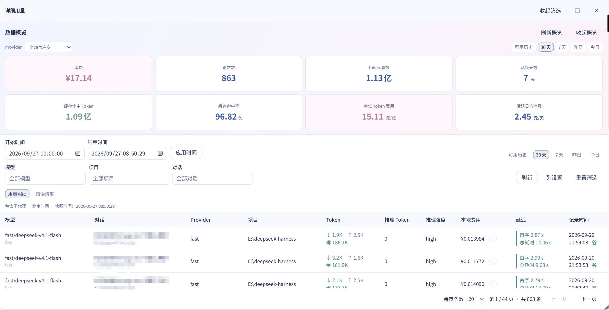
</p>

<table>
  <tr>
    <td align="center" width="50%">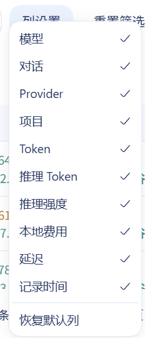<br><sub><b>列设置</b></sub></td>
    <td align="center" width="50%">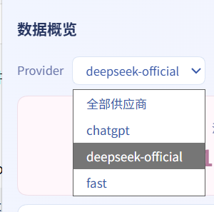<br><sub><b>按供应商查看</b></sub></td>
  </tr>
</table>

<p align="center">
  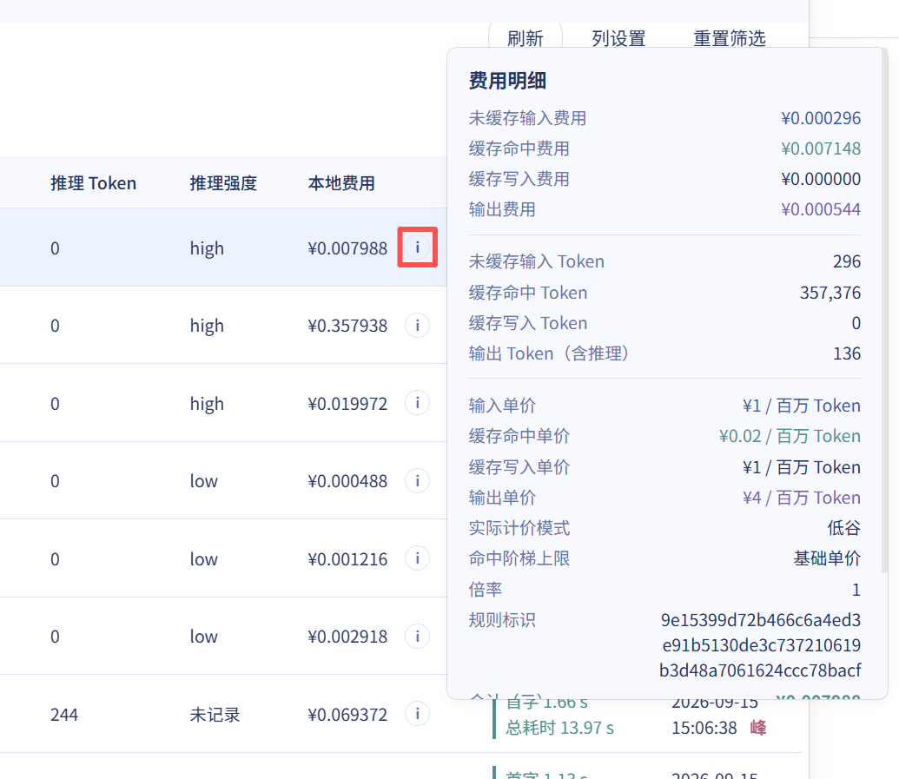
</p>

## 鲸鱼娘

鲸鱼娘是趴在余额悬浮卡上的桌面伙伴。她会用待机和眨眼动作陪你等待，并根据普通扣费、缓存未命中、连续消费、余额耗尽与充值恢复呈现不同反馈。扣费金额按事件顺序排队飘字，不同费用类型使用不同颜色与反馈强度；普通扣费保持轻量，不会频繁弹出气泡打扰工作。

<table>
  <tr>
    <td align="center" width="50%">
      <br>
      <sub><b>等待任务时：啃手指待机</b></sub>
    </td>
    <td align="center" width="50%">
      <br>
      <sub><b>缓存未命中时：严重扣费反应</b></sub>
    </td>
  </tr>
</table>

## 提醒与微信通知

- **每日预算**：设置当日预算金额，首次越过预算线时提醒；提醒不会阻止、取消或限流模型请求。
- **峰谷切换**：进入峰时和进入谷时可分别启用提醒，同一价格边界不会重复通知。
- **缓存异常**：可设置缓存命中率阈值与连续异常次数，恢复后再次异常仍可重新提醒。
- **鲸鱼娘气泡**：只承载预算越线、峰谷切换和缓存异常等需要关注的事件，可独立关闭。
- **ClawBot 微信通知**：在详细设置中查看连接、认证与投递状态，完成二维码登录、刷新、重连、安全断开和测试消息发送。
- **少女风文案**：通道测试、预算越线、进入峰时、进入谷时和缓存异常均使用 `dsh-damage-pulse` 标准项目名；Star 邀请只出现在测试消息中。
- 所有业务通知开关默认关闭；旧配置从 v0、v1、v2、v3 迁移且缺少通知字段时，也会保守补为关闭。发送测试消息是独立的通道验证，不受业务微信通知总开关限制。

<p align="center">
  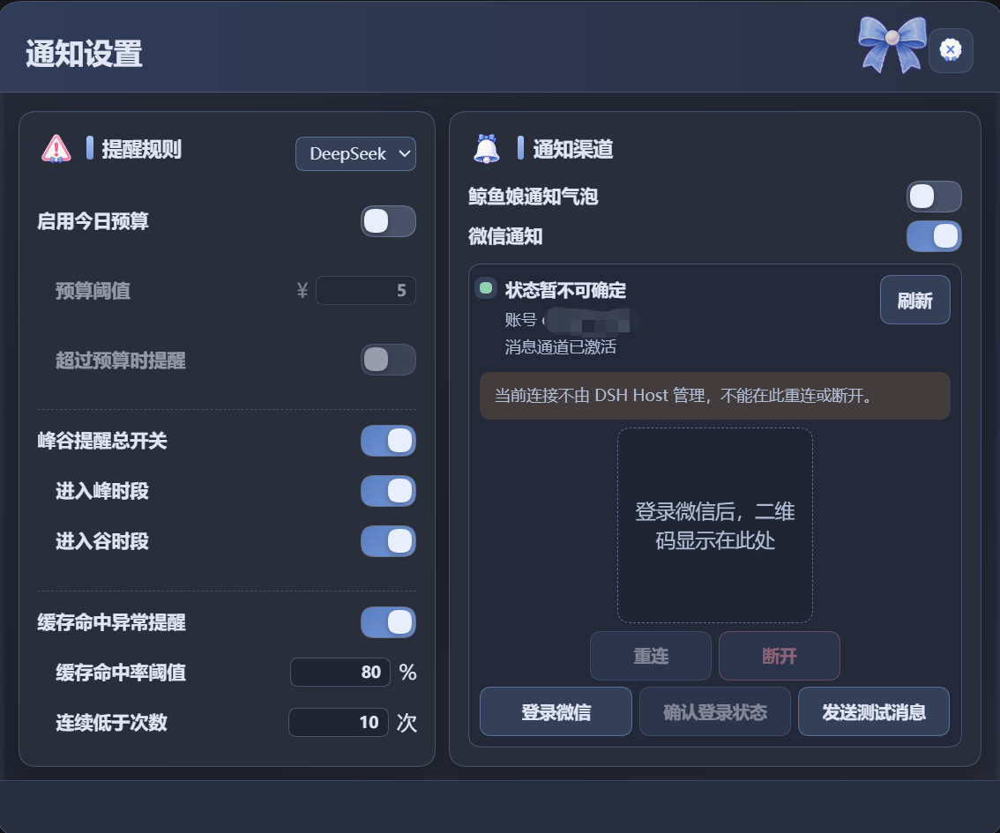
</p>

<p align="center">
  
</p>

## 详细设置与安全更新

插件提供蓝粉双色的响应式详细设置面板，集中展示今日消费与历史统计，并可配置鲸鱼娘、每日预算、峰谷提醒、缓存异常、气泡和微信通知。设置更新使用 revision 防止多个页面互相覆盖，并兼容旧字段迁移。

更新面板可以打开项目主页、检查最新 Release、比较版本并下载安装包。安装前会校验 Release/tag 版本、资产名称、下载来源、重定向域名和 SHA-256，且只有识别到可安装 profile 时才执行安装。

## 架构

> 项目公开品牌为 `dsh-damage-pulse`。为兼容已安装用户，下列目录名、包名、API 路径、设置命名空间和本地存储键仍沿用 `dsh-token-monitor` / `token-monitor`，无需迁移已有配置与历史数据。

| 部分 | 位置 | 职责 |
|---|---|---|
| Host 插件 | `plugins/dsh-token-monitor` | 计费资格、价格计算、持久账本、余额、统计、预算/峰谷/缓存提醒、微信与更新 API |
| Client 包 | `packages/client/ui-token-monitor` | 单次用量、会话累计、余额悬浮卡、鲸鱼娘动画、通知气泡和详细设置 |
| 微信能力 | `plugins/wechat-notify` / ClawBot | 连接状态、登录管理与消息投递；不可用时不会阻塞计费和余额监控 |

## 安装

本仓库从 `0.2.0` 起提供标准 DSH Host + Client 组合包和预编译产物。本次更新加入模块化管理、可视化计费规则（含第三方供应商余额查询脚本）、可拖动缩放的用量明细与窗口化计费规则面板，并把法定节假日并入 DeepSeek 峰谷计价的空闲时段（官方 2026 年 9 月 25 日起生效），同时适配 DSH `0.1.7-rc.2`。`4.0.10` 修复余额数字可能长时间不更新的问题：卡片显示值过去按「接口快照 + 尚未发射的扣费」合成，飘字发射链一旦抛错停摆，60 秒校准就会把余额的下降原样加回，数字被钉死在某个看似合理的值上且无任何可见报错；扣费游标改为在视觉处理之前推进，避免视觉失败让客户端每秒重放整本账并重复扣减；发射链加入自愈（单条发射失败不再杀死队列、队列非空即可续跑、清理时复位定时器引用），余额校准改为先落快照再做充值动画。`4.0.9` 跟随官网 2026 年 9 月的计价说明修正 V4 Pro 计价：官方已取消原定 9 月 14 日 12:00 起按 Flash 价格计费的调整，`deepseek-v4-pro` 继续按 Pro 原价计费，不再在边界时刻切换价格表。`4.0.9` 同时修复三处历史缺陷（内置价格表的历史分段因对象身份判定而从未生效、余额卡片与鲸鱼娘被右侧栏浮动面板遮挡、无事件序号的历史账本行重复计入），并把鲸鱼娘开关写入失败从静默改为提示；`4.0.8` 修复 DSH `0.1.5-alpha.2`（官方 0.1.5 线）下的两项失效：Host 半兼容 0.1.5 的 `SessionHandleReadResult`（`{ eventState, events }` 包裹结果），会话历史金额投影不再整体迁移失败；Client 半改用官方席位 `conversation.session.header.actions`。`4.0.3` 明确兼容 DSH Desktop `2.0.4`（DSH `0.1.2-alpha.1`），并继续支持 `0.1.0-rc.5` 之后的旧版兼容宿主（含 `0.1.0-rc.6/rc.7/rc.8` 与 `0.1.1-rc.2`）。无需复制源码、修改 DSH `tsconfig`、手动传入 `--patch` 或重建 Client bundle。

Desktop `2.0.4` 不再提供旧的 `@deepseek-ai/dsh-client-runtime` 模块；`4.0.3` 已将该包从产品 peer 与 Client 注入图中移除，仅在开发环境保留旧宿主回归测试。

旧版或社区自行打包的 DSH 客户端应在其现有项目中沿用宿主自身的 lock 文件和依赖版本安装本插件。不要在一个新建的纯 npm 依赖树中把 rc.5/rc.6/rc.7 宿主包与当前 registry 的 rc.8 上游包混合钉定；这种组合会因上游 peer 版本漂移而解析失败，并不表示插件与原宿主不兼容。

```powershell
dsh plugin --profile web add github:wssfk12138/dsh-damage-pulse
```

安装后重启 Web profile：

```powershell
dsh --profile web
```

标准包提供余额悬浮栏、余额实时扣减、缓存命中/未命中动画、单次用量行和输入区会话累计。升级自早期源码集成版时，请移除原有手工 `--patch` 或重复挂载项，避免同一插件加载两次。

### 原生会话金额（标准包能力）

会话金额属于标准包能力，标准包开箱即可提供，无需手工改宿主源码：

- **官方会话头席位**（`conversation.session.header.actions`）：0.1.5-alpha 与 rc.7 的会话头都声明该席位，标准包把金额徽标注册到会话标题旁的操作区；`sessionId` 与 `useSessions` 由宿主标准 props 提供，不改任何宿主文件，也无需重建 bundle。
- **兼容宿主侧栏尾席位**（`sidebar.workspaces.sessionRow.trailing`）：该席位由本机侧边栏补丁宿主自行声明，上游 0.1.3 / 0.1.5 都未提供。标准包只在宿主声明后追加注册，会话行在时间前显示金额；未声明时保持等待，不注册也不报错。
- **旧版 / 社区自行打包或定制客户端**（既无官方会话头席位，也无侧栏尾席位）：标准包内置严格 fail-closed 的兼容桥，只在能对原生会话行做唯一、无歧义匹配时显示金额；一旦检测到宿主已带正式席位标记、稳定会话标识或既有金额，立即整体停用，不会重复写入。
- **输入区会话累计条** 行为不变，上述所有客户端下都可用。

`scripts/apply-sidebar-integration.ps1` 保留为完整 DSH 源码部署的开发/历史兼容工具；标准包已自动显示金额时无需运行。如需在完整 DSH 源码上手工挂载，运行：

```powershell
.\scripts\apply-sidebar-integration.ps1 -HarnessRoot 'C:\path\to\deepseek-harness'
$env:DSH_BUILD_FACE = 'client'
corepack pnpm --dir 'C:\path\to\deepseek-harness\packages\client\ui-workspace' exec tsdown
```

脚本会先备份三个目标文件，并以幂等方式读取 `projectionValues.tokenCost.cost`。上游结构不匹配时会停止，不会猜测写入。

### 源码开发

```powershell
corepack pnpm install
corepack pnpm build
corepack pnpm run check:bundle
```

## 配置

### API Key

通过 DSH 的 credentials 机制配置 `DEEPSEEK_API_KEY`（`~/.dsh/.credentials.yaml`），未配置时余额卡片显示引导态，token 计量不受影响。

### 价格表（可选覆盖）

价格表默认内置（见 `src/pricing.ts`），可通过 settings namespace `dsh-token-monitor` 的 `priceTable` 字段覆盖价格和工作日高峰时段。周一至周五默认按北京时间 `9:00–12:00`、`14:00–18:00` 为峰价，其余时间为谷价；周六、周日与法定节假日无论时段均按谷价，调休上班的周末同样整日按谷价。内置默认表按生效时间分段：8 月 17 日 00:00 之前按旧统一价，8 月 17 日 00:00 至 9 月 10 日 12:00 按旧峰谷价，之后按上表现行价格。传入自定义 `priceTable` 时视为整体覆盖，直接用于当年 8 月 17 日及之后的全部历史与新增调用；8 月 17 日之前的调用仍按官方旧统一价计费。官方依据：[模型与价格](https://api-docs.deepseek.com/zh-cn/quick_start/pricing/)、[图像理解 Token 用量](https://api-docs.deepseek.com/zh-cn/guides/vision#token-usage)。

## HTTP 端点

| 端点 | 说明 |
|---|---|
| `GET /api/token-monitor/balance` | DeepSeek 账户余额（含 currency / 总余额 / 赠送余额） |
| `GET /api/token-monitor/usage?sessionId=` | 用量明细历史（可过滤会话） |
| `GET /api/token-monitor/usage-summary?range=` | 今日 / 7 天 / 30 天 / 全部时间的聚合统计 |
| `GET /api/token-monitor/charge-events?since=<seq>` | 严格递增的扣费事件流，驱动余额变化、飘字和受击动画 |
| `GET /api/token-monitor/notification-events?since=<seq>` | 预算、峰谷和缓存异常通知流 |
| `GET/PATCH /api/token-monitor/settings` | 带 revision 的统一设置读取与更新 |
| `GET /api/token-monitor/wechat/status` | 查询微信连接、认证、投递和短时登录会话状态；设置页“刷新”会重新请求此端点 |
| `POST /api/token-monitor/wechat/login` | 创建二维码登录会话 |
| `POST /api/token-monitor/wechat/login/confirm` | 确认当前二维码登录状态 |
| `POST /api/token-monitor/wechat/reconnect` | 重连由 DSH Host 管理的微信 bridge |
| `POST /api/token-monitor/wechat/disconnect` | 经显式确认后断开由 DSH Host 管理的微信 bridge |
| `POST /api/token-monitor/wechat/test` | 发送独立测试消息，不受业务微信通知总开关限制 |
| `GET/POST /api/token-monitor/update*` | Release 检查与受安全门禁保护的安装流程 |

## 微信通知兼容层

插件内置一个不注册 Cordis 工具的轻量 ClawBot 适配器，并按以下优先级选择通知 provider：新版外部 wechat-notify 能力对象 → 旧版 send() / status() 接口 → 内置适配器 → 不可用。任一时刻只会选择一个 provider；微信未登录、超时或发送失败不会阻塞余额监控、计费和鲸鱼娘动画。

如果用户已经安装独立 dsh-wechat-notify，本插件会复用它的发送能力；未安装时，只要设置 `WECHAT_NOTIFY_CLAWBOT_INDEX`，内置适配器即可开箱发送。该变量必须指向本机 ClawBot CLI 的入口文件，例如：

```powershell
$env:WECHAT_NOTIFY_CLAWBOT_INDEX = 'C:\path\to\clawbot-cli\dist\index.js'
dsh --profile web
```

兼容层不迁移或删除原插件凭据，也不会重复注册 wechat_notify、扫码工具或 bridge。旧版接口若只能发送，状态面板会明确标注“发送可用，登录管理由原插件负责”。

## 常见问题

- **余额卡片显示「未配置」**：未配置 `DEEPSEEK_API_KEY`，token 计量仍正常。
- **会话金额没有显示**：标准包把金额徽标注册到官方会话头席位（`conversation.session.header.actions`，会话标题旁的操作区）；旧版 / 定制客户端由标准包内置的 fail-closed 兼容桥在能安全匹配原生侧栏会话行时显示。若仍未出现，先确认重启了目标 profile；完整源码部署可选运行开发兼容脚本，但标准包已显示金额时不要再运行，避免重复写入。输入区会话累计条始终可用。
- **只有旧会话没有金额**：插件加载前结束的旧会话需在下次启动时自动补齐（插件启动时对缺失投影的历史会话触发冷读 fold），启动后请稍等几秒再刷新页面。
- **窗口启动后仍无动画**：确认已重启安装目标 profile；若以前使用过源码集成版，先删除旧的手工 patch 和重复挂载。

## 社区与反馈

欢迎在 [LINUX DO 社区](https://linux.do/) 交流使用体验、反馈问题和分享改进建议。插件的安装、运行和全部功能均不依赖任何中转服务或充值渠道。

社区提交经复核后会合并进主线，并在发行说明与本文件中署名。已合入：`@gurio-wine`（PR #17：桌面端卡片位置与鲸鱼娘开关修复，包含在 `4.0.9`）。

## 许可证

MIT

<a id="sponsor"></a>
<h2>赞助商简介<br><sub><sup>免费不意味着开发没有成本。感谢<a href="https://www.fastaitoken.com/register?aff=BF9KNKFHX725&promo=WSSFK">Fastai</a>的赞助，让我能把功能留给所有用户，把广告留在应用之外。</sup></sub></h2>

如果你正在寻找稳定、实惠的 AI 模型中转服务，可以试试 [Fastai](https://www.fastaitoken.com/register?aff=BF9KNKFHX725&promo=WSSFK)，[Fastai](https://www.fastaitoken.com/register?aff=BF9KNKFHX725&promo=WSSFK) 提供 DeepSeek、GLM、kimi、GPT、Claude、grok 等模型厂商的旗舰模型，同时还提供 image2.5、**Seedance 2.0** 等最先进的图片和视频生成模型。国模分组采用大厂自部署模型，低延迟高缓存，注册即送 3$ 体验金，欢迎试用。目前 GPT 分组不能完全保证不降智，推荐使用其它分组。本项目全程使用 [Fastai](https://www.fastaitoken.com/register?aff=BF9KNKFHX725&promo=WSSFK) 提供的 GPT、DeepSeek 等模型开发，你的每一笔充值都会使我获得返利和更多 token 来继续维护和开发新功能。 下图是我的 [Fastai](https://www.fastaitoken.com/register?aff=BF9KNKFHX725&promo=WSSFK) 账户使用记录，重度使用一个月，亲测好用。

<p>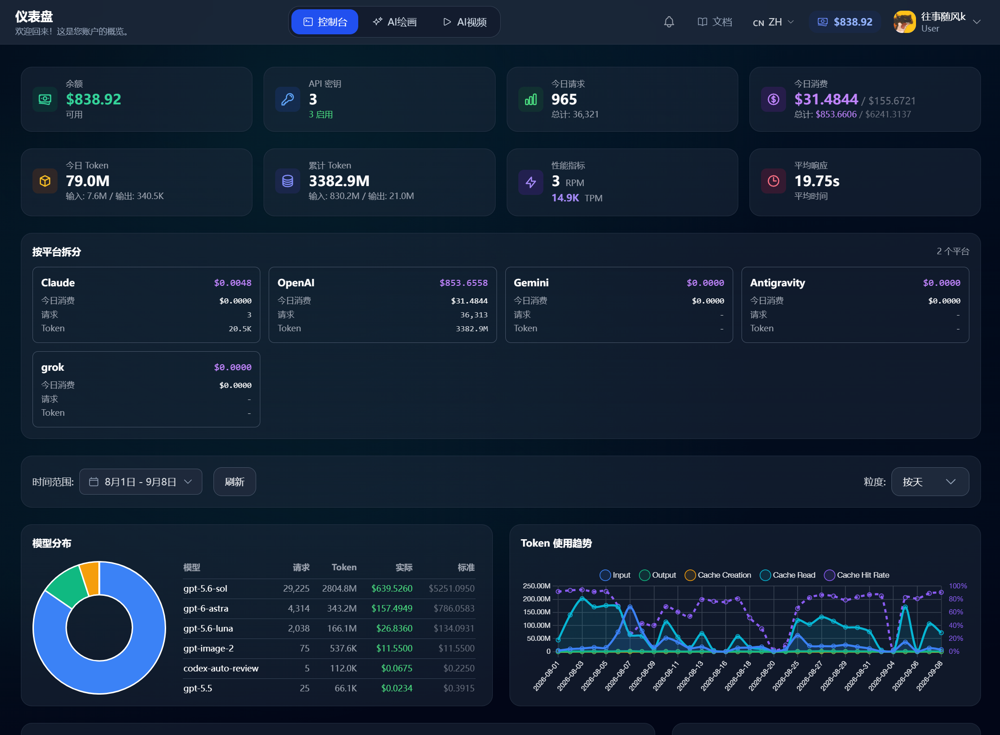</p>

<p>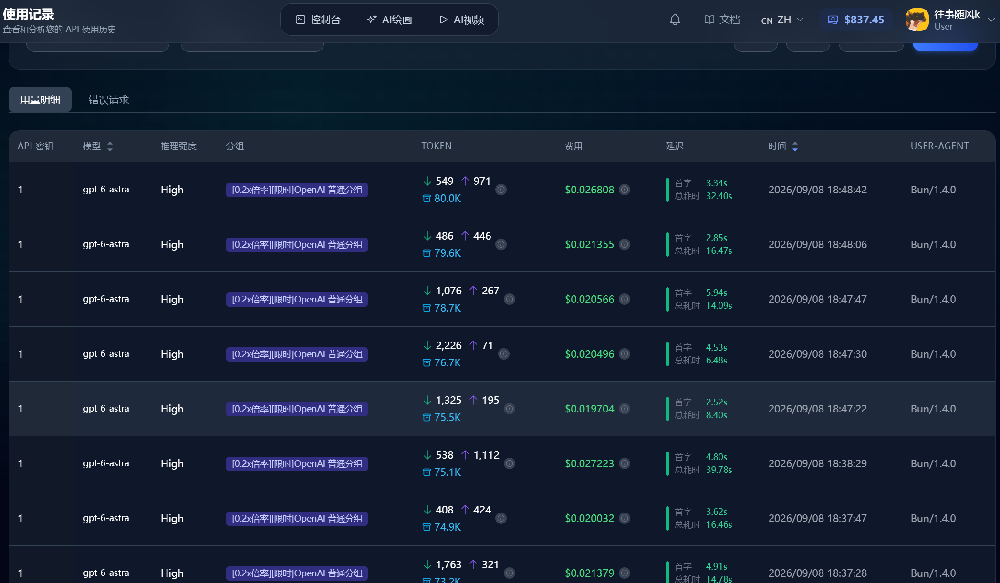</p>
